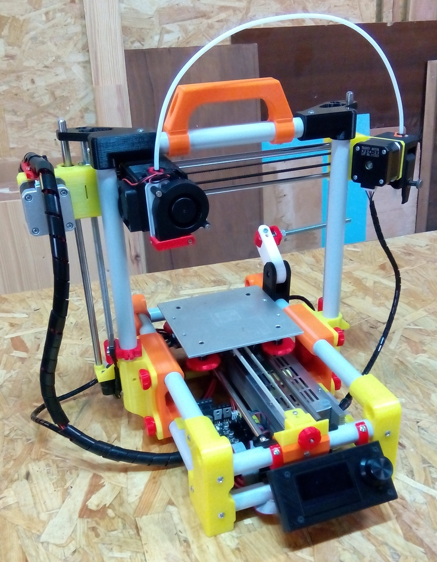

## Assembled Printer

* **Print volume (test model):** 140x140x135mm.

* **Print volume (maximun):** 150x150x150mm

* **Printer size (foldded):** (L)370x(W)97x(H)480mm.

* **Printer size (unfoldded):** (L)370x(W)390x(H)375mm.

* **Printer Weight:** 5 kg.

* **Pipe diameter:** 20mm.

## Gallery

Foldapipe test model front view.

Foldapipe test model rear view.

Foldapipe test model deployed and ready to print.
